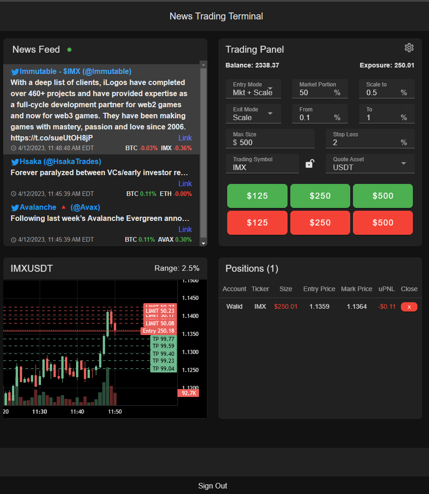

# News Trading Terminal (NTT)

NTT is a convenient app that merges up-to-date cryptocurrency news with an intuitive trading panel, enabling quick and informed trading decisions based on current market insights. Crafted for efficiency, it bypasses traditional backend dependencies to offer direct desktop-to-exchange order execution, drastically reducing trade latency.

## Core Technologies
- Frontend: Developed with Vue.js for a dynamic and responsive UI.
- Desktop Integration: Utilizes Tauri for a lightweight, secure desktop application experience.
- Infrastructure: Employs AWS services including Lambda, S3, API Gateway, DynamoDB, and Cognito for a robust, secure, and scalable backend. Cognito 
  ensures user authentication, while Lambda and DynamoDB handle data management and API Gateway manages auto-updates.
- CI/CD: Automated builds and deployments via GitHub Workflows, pushing updates directly to S3.
  
NTT combines modern web technologies and cloud infrastructure to deliver a seamless trading experience directly from your desktop.

